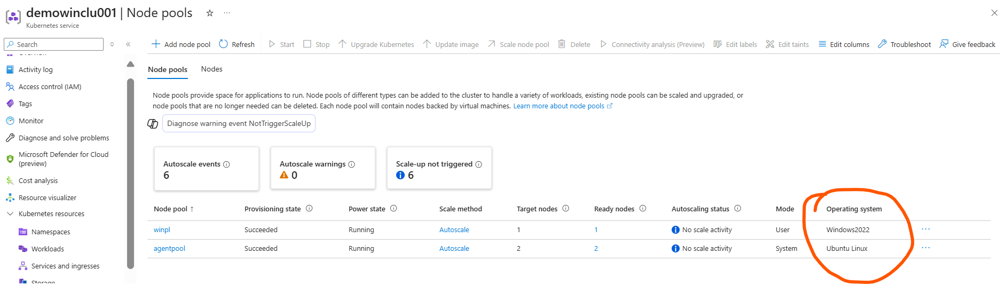
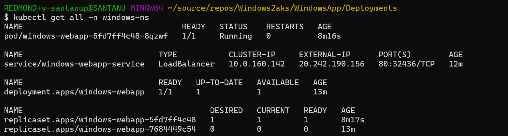
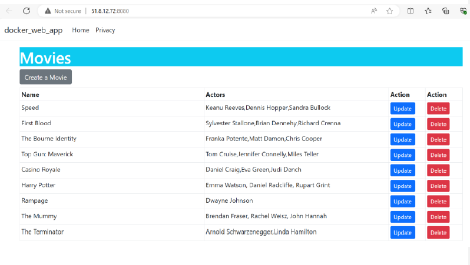
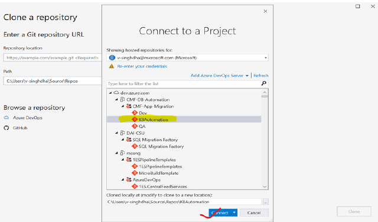

# MIGRATING CONTAINERIZED APPLICATION TO AKS


## Document Summary
  See the full [Document Summary](Document-Summary.md)
## Change Log
  Full change history is available in the [Change Log](Change-Log.md)


## Contents

1. [**Introduction**](#1-introduction)
    - [1.1 Azure Kubernetes Service (AKS)](#11-azure-kubernetes-service-aks)
	- [1.2 Key Features of AKS](#12-key-features-of-aks)  
	- [1.3 Reference Architecture](#13-reference-architecture)
2. [**Role and Responsibilities**](#2-role-and-responsibilities)
3. [**Planning**](#3-planning)
4. [**Pre-requisites**](#4-pre-requisites)
5. [**Execution: Migration Steps for Containerized Apps on AKS**](#5.0-execution-migration-steps-for-containerized-apps-on-aks)
- [5.1 SCENARIO - LINUX Containers](#51-scenario---linux-containers)
   - [5.1.1 Prepare an application for Azure Kubernetes Service (AKS)](#511-prepare-an-application-for-azure-kubernetes-service-aks)
   - [5.1.2 Create an Azure Container Registry (ACR) and push build images.](#512-create-an-azure-container-registry-acr-and-push-build-images)  
   - [5.1.3 Create an Azure Kubernetes Service (AKS) cluster.](#513-create-an-azure-kubernetes-service-aks-cluster)
   - [5.1.4 Deploy an application to Azure Kubernetes Service (AKS)](#514-deploy-an-application-to-azure-kubernetes-service-aks)
   - [5.1.5 Use Persistent Volume (PV) and Persistent Volume Claim (PVC) in the deployment.](#515-use-persistent-volume-pv-and-persistent-volume-claim-pvc-in-the-deployment)

 - [5.2 SCENARIO - WINDOWS Containers](#52-scenario---windows-containers)

    - [5.1.1 Prepare an application for Azure Kubernetes Service (AKS)](#521--prepare-a-windows-based-application-for-azure-kubernetes-service)
    - [5.1.2 Create an Azure Container Registry (ACR) and push build images](#522create-an-azure-container-registry-acr-and-push-build-images)
    - [5.1.3 Create an Azure Kubernetes Service (AKS) cluster](#523-create-aks-cluster-with-windows-node-pool)
    - [5.1.4 Deploy an application to Azure Kubernetes Service (AKS)](#524-deploy-the-application-to-azure-kubernetes-service-aks)

6. [**Deploying application using CICD Pipelines:**](#6-deploying-application-using-cicd-pipelines)    

  - [6.1 SCENARIO - LINUX Containers](#61-scenario---linux-containers)
    - [6.1.1 Deployment using GITHUB actions](#611-deployment-using-github-actions)
    - [6.1.2 Deployment using Azure Pipelines YAML (Azure DevOps Pipelines)](#612-deployment-using-azure-pipelines-yaml-azure-devops-pipelines)  

  - [6.2 SCENARIO - WINDOWS Containers](#62-scenario---windows-containers)
    - [6.2.1 Deployment using GITHUB actions](#621-deployment-using-github-actions)
    - [6.2.2 Deployment using Azure Pipelines YAML (Azure DevOps Pipelines)](#622-deployment-using-azure-pipelines-yaml-azure-devops-pipelines)
   - [6.3 Deployment using Azure Classic Pipelines (Azure DevOps Pipelines)](#63-deployment-using-azure-classic-pipelines-azure-devops-pipelines)
       - [6.3.1 Push our existing code to azure repositories:](#631-push-our-existing-code-to-azure-repositories)
       - [6.3.2 Create classic pipeline to deploy the application to AKS Cluster:](#632-create-classic-pipeline-to-deploy-the-application-to-aks-cluster) 
7. [**References**](#7-references)

## 1. Introduction

This portion offers a concise overview of Azure Kubernetes Service (AKS) along with its key features and reference architecture.

### 1.1 Azure Kubernetes Service (AKS)

Azure Kubernetes Service (AKS) is a managed service by Azure for deploying and managing containerized applications. It requires minimal container orchestration expertise to use AKS. Azure Kubernetes Service (AKS) simplifies the management of Kubernetes clusters by transferring much of the operational burden to Azure. AKS serves as a robust platform for deploying and managing containerized applications that demand high availability, scalability, and portability. It is particularly suitable for deploying applications across multiple regions, leveraging open-source tools, and integrating seamlessly with existing DevOps tools.

This document assists platform administrators or developers in deploying containerized apps to scalable AKS and automating tasks with DevOps tools like GitHub actions and Azure DevOps pipelines.

### 1.2 Key Features of AKS

#### 1. Managed Kubernetes Service

- #### Automated Upgrades and Patching:
	AKS provides automatic Kubernetes version upgrades and patching, reducing the operational burden on administrators.

- #### Managed Control Plane:
	Azure manages the Kubernetes control plane, including the API server and etcd, ensuring high availability and resilience.

#### 2. Scalability and Flexibility:
- #### Cluster Autoscaling:
	Automatically adjusts the number of nodes in your cluster based on the workload demands.

- #### Virtual Nodes:
	Seamlessly burst to Azure Container Instances (ACI) to handle spikes in traffic without managing additional Kubernetes nodes.

- #### Multi-Region Clusters:
	Deploy AKS clusters across multiple regions for disaster recovery and high availability.


 #### 3. Integration with Azure Ecosystem:
- #### Azure Active Directory (AAD) Integration:
	Integrate with AAD for user authentication and role-based access control (RBAC).

- #### Azure Monitor for Containers:
	Provides comprehensive monitoring and logging for your AKS clusters, with integrations for Prometheus and Grafana.

- #### Azure Policy:
	Enforce policies on your AKS resources, ensuring compliance with organizational standards.

- #### Azure DevOps:
	Seamlessly integrate with Azure DevOps for CI/CD pipelines to automate your application deployment process.

 #### 4. Security and Compliance:
- #### Network Policies:
	Use Azure CNI and Calico to define and enforce network policies for pod communication.

- #### Pod Security Policies:
	Define security policies to control the security context of pods.

- #### Azure Key Vault Integration:
	Securely manage secrets, certificates, and keys using Azure Key Vault.

- #### Azure Private Link:
	Securely connect to Azure services without exposing traffic to the public internet.

 #### 5. Developer Productivity:
- #### Azure Dev Spaces:
	Simplify the development of microservices-based applications on AKS with iterative development and debugging capabilities.

- #### Helm Support:
	Easily deploy and manage Kubernetes applications using Helm charts.

- #### Open Service Broker for Azure:
	Simplify the provisioning of Azure services from within your Kubernetes applications.

 #### 6. High Availability and Reliability:
- #### Availability Zones:
	Deploy AKS clusters across multiple availability zones to protect against data centre failures.

- #### Disaster Recovery:
	Set up disaster recovery for your applications using multi-region deployments and Azure Site Recovery.

 #### 7. Cost Management:
- #### Per-Second Billing:
	Only pay for the compute resources you use, with per-second billing.

- #### Node Pool Management:
	Create multiple node pools within a single cluster, allowing for optimized resource allocation based on workload requirements

- #### Reserved Instances and Spot Pricing:
	Optimize costs by using reserved instances and spot pricing for your AKS nodes.

 #### 8. Hybrid and Edge Deployments:
- #### Azure Arc:
	Manage Kubernetes clusters running on-premises or in other cloud environments with Azure Arc.

- #### AKS on Azure Stack HCI:
	Run AKS on Azure Stack HCI to bring cloud-native applications to your on-premises data centres.

 #### 9. Storage Integration:
- #### Azure Disks and Files:
	Use Azure Managed Disks and Azure Files for persistent storage in your AKS clusters

- #### CSI Drivers:
	Support for Container Storage Interface (CSI) drivers to provision and manage storage resources.

 #### 10. Networking:
- #### Azure CNI and Kubenet:
	Choose between Azure CNI and Kubenet for network management, providing flexibility in how you configure networking for your clusters.

- #### Load Balancers and Ingress Controllers:
	Use Azure Load Balancers and various Ingress controllers to manage incoming traffic.

### 1.3 Reference Architecture

The image below demonstrates the process of building, containerizing, and pushing the code into ACR, followed by its deployment using Azure DevOps pipelines.


The image below depicts the AKS architecture, highlighting that customer VMs are under developers' ownership with applications deployable via Kubernetes API endpoints.


## 2. Role and Responsibilities

| **Task**                        | **Responsible**     | **Accountable**     | **Consulted**           | **Informed**         |
|---------------------------------|----------------------|----------------------|--------------------------|----------------------|
| Cluster Creation                | Customer / Partner   | Customer / Partner   | Customer / Partner       | FACTORY              |
| Assessment Report to be shared | Customer / Partner   | Customer / Partner   | Customer / Partner       | FACTORY              |
| Analysis Report Preparation     | FACTORY              | FACTORY              | Customer / FACTORY       | Customer / Partner   |
| Application Deployment to AKS Cluster     | FACTORY/Customer              | FACTORY/Customer              | FACTORY/Customer       | FACTORY/Customer   |

---

## 3. Planning

1. Ensure Cluster administration access.
2. Contributor role on azure subscription.

---

## 4. Pre-requisites

- Finalization of the applications to be migrated (Wave planning)  
- Run Azure migrate tool for assessment / Manual discovery of the applications - Identify all applications, services, and dependencies running on the VM.
- Landing Zone Create for an AKS Cluster
- Configure networking, storage, and security settings in AKS.
- Cluster Access & Contributor role access.
- Access to Manifest files (if existing)
- Connectivity between the sites
- Ensure DB connectivity is available with very low latency.
- Complete the Code Remediation before the migration to ensure that it meets the migration requirements [config maps, storage classes, limits, secrets etc.]
- Project namespaces to be collected & replicated / created.
- Ensure proper DNS resolution in the Environment.
- Prepare Target Architecture Diagram as per Microsoft Reference Architecture diagram.
- Approval from Customer
- Configure Microsoft Entra authentication for an AKS cluster.
- Assess the performance, load, and resource utilization of the application.
- Determine the scaling requirements.
- Convert the application into container images using Docker.
- Create Dockerfile for each application component.
- Ensure backups are in place before the migration.
- Configure a CI/CD pipeline using tools like GitHub / Azure DevOps.


## 5.0 Execution: Migration Steps for Containerized Apps on AKS

## 5.1 SCENARIO - LINUX Containers

## 5.1.1. Prepare an application for Azure Kubernetes Service (AKS)

Let’s prepare a multi-container application to use in Kubernetes. You use existing development tools like Docker Compose to locally build and test the application. Please make sure you have a docker desktop installed in your machine.
- Create a container image from the sample application source.
- Test the multi-container application in a local Docker environment.
We have a very simple movie app which we will be deploying to AKS cluster. We will run the docker-compose.yaml file in your laptop and test the application locally. Below is the docker-compose file and Dockerfile of the application for your reference.

#### docker-compose.yml:


#### Dockerfile:


Execute the command below to run and test the application locally.

   ```bash
    docker compose -f docker-compose.yaml up -d
   ```


Stop and remove the container instances and resources using the [docker-compose down](https://docs.docker.com/compose/reference/down) command once the local testing is complete.

   ```bash
   docker compose down
   ```

## 5.1.2 Create an Azure Container Registry (ACR) and push build images.

1. Create a resource group using the az group create command.

  ```bash
  az group create --name myResourceGroup --location eastus
  ```

2. Create an ACR instance using the [az acr create](https://learn.microsoft.com/en-us/cli/azure/acr?view=azure-cli-latest#az_acr_create) command and provide your own unique Registry name.
  ```bash
  az acr create --resource-group myResourceGroup --name $ACRNAME --sku Basic
  ```

3. Build and Push images to the repository using the below commands.

  ```bash
  az acr login --name $ACRNAM docker build -t $ACRNAME.azurecr.io/dockerwebapp:latest . docker push $ACRNAME.azurecr.io/dockerwebapp:latest
  ```


## 5.1.3 Create an Azure Kubernetes Service (AKS) cluster.

#### 1. Install kubctl

You use the Kubernetes CLI, [kubectl](https://kubernetes.io/docs/reference/kubectl/), to connect to your Kubernetes cluster. If you use the Azure Cloud Shell, kubectl is already installed. If you're running the commands locally, you can use Azure CLI or Azure PowerShell to install kubectl.
Install kubectl locally using the [az aks install-cli](https://learn.microsoft.com/en-us/cli/azure/aks?view=azure-cli-latest#az_aks_install_cli) command.

  ```bash
  az aks install-cli
  ```

##### 2. Create AKS Cluster

Create a very basic AKS cluster using the [az aks create](https://learn.microsoft.com/en-us/cli/azure/aks?view=azure-cli-latest#az_aks_create) command. The following example creates a cluster named mydemoAKSCluster in the resource group named myResourceGroup.

  ```bash
  az aks create \ --resource-group myResourceGroup \ --name mydemoAKSCluster \ --node-count 2 \ --generate-ssh-keys \
  ```

The above command will create a cluster with two nodes and with a default setup. You can use azure portal and try different options and workloads based on project needs.


To avoid needing an **Owner** or **Azure account administrator** role, you can also manually configure a service principal to pull images from ACR. For more information, see [ACR](https://learn.microsoft.com/en-us/azure/container-registry/container-registry-auth-service-principal) authentication with service principals or [authenticate from Kubernetes with a pull secret](https://learn.microsoft.com/en-us/azure/container-registry/container-registry-auth-kubernetes). Alternatively, you can use a managed identity instead of a service principle for easier management.

##### 3. Create Kubernetes Pull Secret: 

For this runbook we will use Kubernetes pull secret using a token to pull images from ACR.

Navigate to **“Repository permission”** and navigate to **“scope-maps”** and create a new scope, call it **“my-scope-map”**. We have selected our repository and added “content/read” permission to the repository scope.


Next, we must set “Token” which will be used for creating pull secret. Create a new token “my-token” which is associated with the scope-maps and generate the password which we will use to create the pull secret.

  ```bash
  kubectl create secret docker-registry acr-secret --docker-server=aksdemoreg.azurecr.io --docker-username=my-token --docker-password=<<my-token password generated in the previous step>> --docker-email=unused –-name=my-aks-namespace
  ```

##### 4. Connect to cluster using kubectl: 

Configure kubectl to connect to your Kubernetes cluster using the [az aks get-credentials](https://learn.microsoft.com/en-us/cli/azure/aks?view=azure-cli-latest#az_aks_get_credentials) command. The following example gets credentials for the AKS cluster named mydemoAKSCluster in myResourceGroup.

  ```bash
  az aks get-credentials --resource-group myResourceGroup --name mydemoAKSCluster
  ```

Verify connection to your cluster using the [kubectl get nodes](https://kubernetes.io/docs/reference/generated/kubectl/kubectl-commands#get) command, which returns a list of cluster nodes.

  ```bash
  kubectl get nodes
  ```

## 5.1.4 Deploy an application to Azure Kubernetes Service (AKS)

Create Kubernetes manifest file and deploy the application. For example, we have created two deployment resources, one for the webapp and SQL database and two services for the respective web app and the SQL database. Please refer to the deployment manifest file for your reference. Please make sure they associate the pull secret with the manifest deployment file.
```yaml
        Deployment_manifest.yaml:
        ------------------------
        apiVersion: apps/v1
        kind: Deployment
        metadata:
          labels:
            app: docker-web-app
          name: docker-web-app
        spec:
          replicas: 1
          selector:
            matchLabels:
              app: docker-web-app
          template:
            metadata:
              labels:
                app: docker-web-app
            spec:
              containers:
                - env:
                    - name: DB_HOST
                      value: sqlcontainerdb
                    - name: DB_NAME
                      value: DockerSQLDatabase
                    - name: DB_SA_PASSWORD
                      value: <<password of your choice>>
                    - name: DB_USER_ID
                      value: SA
                  image: aksdemoreg.azurecr.io/dockerwebapp:latest
                  name: docker-web-app
                  ports:
                    - containerPort: 8080
                      protocol: TCP
              restartPolicy: Always
              imagePullSecrets:
                 - name: acr-secret    
            
        ---
        apiVersion: v1
        kind: Service
        metadata:
          labels:
            app: docker-web-app
          name: docker-web-app
        spec:
          ports:
            - name: "8080"
              port: 8080
              targetPort: 8080
          selector:
            app: docker-web-app
          type: LoadBalancer  
        ---
        apiVersion: apps/v1
        kind: Deployment
        metadata:
          labels:
            app: sqlcontainerdb
          name: sqlcontainerdb
        spec:
          replicas: 1
          selector:
            matchLabels:
              app: sqlcontainerdb
          template:
            metadata:
              labels:
                app: sqlcontainerdb
            spec:
              containers:
                - env:
                    - name: ACCEPT_EULA
                      value: "Y"
                    - name: MSSQL_SA_PASSWORD
                      value: <<password of your choice>>
                  image: mcr.microsoft.com/mssql/server:2022-latest
                  name: docker-container-database
                  ports:
                    - containerPort: 1433
                      protocol: TCP
              restartPolicy: Always
        ---
        apiVersion: v1
        kind: Service
        metadata:
          labels:
            app: sqlcontainerdb
          name: sqlcontainerdb
        spec:
          ports:
            - name: "1433"
              port: 1433
              targetPort: 1433
          selector:
            app: sqlcontainerdb
          type: ClusterIP
```
1. Create a new namespace and call it as “my-aks-namespace”. We will deploy our application inside this namespace.

  ```bash
  kubectl create namespace my-aks-namespace
  ```

   

2. Deploy the application using the kubectl apply command, which parses the manifest file and creates the defined Kubernetes objects.

  ```bash
  kubectl apply -f deployment-manifest.yaml -n my-aks-namespace
  ```

   

3. Check the deployment is successful by viewing the pods with kubectl.

    

4. Check the services and ingress section and use the external IP associated with the service to access the application.

    


## 5.1.5 Use Persistent Volume (PV) and Persistent Volume Claim (PVC) in the deployment.

1. In the above deployment model, the data does not persist in case of any pod failure and application restarts. To prevent this, we can store the database data at a persistent volume to preserve the data. In this demo we will use Azure Storage – File share option to store our data.

   #### a. Create an Azure Storage Account:
    i. Go to the Azure Portal and create a new Storage Account if you don’t have one.
    #### b.Create a File Share:
    i. In the Storage Account, go to the "File shares" section and create a new file share. Name it something like mssql-fileshare.

    

2. Create a new namespace and call it as “my-aks-namespace-pvc”. We will deploy our application inside this namespace.
    
  ```bash
  kubectl create namespace my-aks-namespace-pvc
  ```

3. Create a Kubernetes Secret for Azure Storage Account. Example manifest below.

    

4. Create the persistent volume and claim. Below is a sample manifest for PV and PVC.

    


5. Modify the SQL Server Deployment to Use Azure File Share. Below is the full example manifest file
```yaml
            deployment-manifest-pvc.yaml:
            ----------------------------

            apiVersion: v1
            kind: PersistentVolume
            metadata:
              name: azurefile-pv
            spec:
              capacity:
                storage: 1Gi
              accessModes:
                - ReadWriteMany
              azureFile:
                secretName: azure-secret
                shareName: mssql-fileshare
                readOnly: false
              persistentVolumeReclaimPolicy: Retain
            
            ---
            apiVersion: v1
            kind: PersistentVolumeClaim
            metadata:
              name: azurefile-pvc
            spec:
              accessModes:
                - ReadWriteMany
              resources:
                requests:
                  storage: 1Gi
              storageClassName: ""
              volumeName: azurefile-pv
            ---
            apiVersion: apps/v1
            kind: Deployment
            metadata:
              labels:
                app: docker-web-app
              name: docker-web-app
            spec:
              replicas: 1
              selector:
                matchLabels:
                  app: docker-web-app
              template:
                metadata:
                  labels:
                    app: docker-web-app
                spec:
                  containers:
                    - env:
                        - name: DB_HOST
                          valueFrom: 
                            configMapKeyRef:
                              key: DB_HOST
                              name: docker-app-configmap
                        - name: DB_NAME
                          valueFrom: 
                            configMapKeyRef:
                              key: DB_NAME
                              name: docker-app-configmap
                        - name: DB_SA_PASSWORD
                          valueFrom: 
                            secretKeyRef:
                              key: DB_SA_PASSWORD
                              name: docker-app-secret
                        - name: DB_USER_ID
                          valueFrom: 
                            configMapKeyRef:
                              key: DB_USER_ID
                              name: docker-app-configmap
                      image: aksdemoreg.azurecr.io/dockerwebapp:latest
                      name: docker-web-app
                      ports:
                        - containerPort: 8080
                          protocol: TCP
                  restartPolicy: Always
                  imagePullSecrets:
                     - name: acr-secret  
            ---
            apiVersion: v1
            kind: Service
            metadata:
              labels:
                app: docker-web-app
              name: docker-web-app
            spec:
              ports:
                - name: "8080"
                  port: 8080
                  targetPort: 8080
              selector:
                app: docker-web-app
              type: LoadBalancer  
            ---
            apiVersion: apps/v1
            kind: Deployment
            metadata:
              labels:
                app: sqlcontainerdb
              name: sqlcontainerdb
            spec:
              replicas: 1
              selector:
                matchLabels:
                  app: sqlcontainerdb
              template:
                metadata:
                  labels:
                    app: sqlcontainerdb
                spec:
                  containers:
                    - name: docker-container-database
                      image: mcr.microsoft.com/mssql/server:2022-latest
                      env:
                        - name: ACCEPT_EULA
                          value: "Y"
                        - name: MSSQL_SA_PASSWORD
                          valueFrom: 
                            configMapKeyRef:
                              key: MSSQL_SA_PASSWORD
                              name: sqldb-configmap
                      ports:
                        - containerPort: 1433
                          protocol: TCP
                      volumeMounts:
                        - name: mssql-data
                          mountPath: /var/opt/mssql  # Default SQL Server data directory
                  volumes:
                    - name: mssql-data
                      persistentVolumeClaim:
                        claimName: azurefile-pvc
                  restartPolicy: Always
            ---
                apiVersion: v1
                kind: Service
                metadata:
                labels:
                app: sqlcontainerdb
                name: sqlcontainerdb
            spec:
              ports:
                - name: "1433"
                  port: 1433
                  targetPort: 1433
              selector:
                app: sqlcontainerdb
              type: ClusterIP
```
6. Deploy the application using the kubectl apply command, which parses the manifest file and creates the defined Kubernetes objects.

  ```bash
  kubectl apply -f deployment-manifest-pvc.yaml -n my-aks-namespace-pvc
  ```

7. Once deployed, check the services and ingress section and use the external IP associated with the service to access the application.

    

## 5.2. SCENARIO - WINDOWS Containers

## 5.2.1.  Prepare a windows-based application for Azure Kubernetes Service
Let’s create a sample .NET Framework application using MVC. This is a very simple photo gallery application. This is a created-on windows and the air is to create a windows container for this application, push to azure container registry and finally host the windows container in azure Kubernetes service (AKS ).

We have tested the application in our local system and hosted it on IIS webserver and this is our application looks like in the local system.


Let’s Dockerize the application using windows containers and test it locally before pushing the image to azure container registry (ACR).

This is the sample DockerFile of the application. For simplicity, we haven’t used the code published in the DockerFile itself.


*** We are manually doing the code publish using Visual Studio Folder publish option for simplicity and storing the binaries in the “publish” folder. ***

Once, the Dockerfile is finalized build and test the application locally using docker desktop.

```bash
docker build -t windows-app .
docker run -d -p 80:80 windows-app
```


Browse, the container to check if the application is working as expected locally after moving it to windows containers.


## 5.2.2	Create an Azure Container Registry (ACR) and push build images.

1. Create a resource group using the az group create command.

    ```bash
    az group create --name myResourceGroup --location eastus
    ```

2. Create an ACR instance using the az acr create command and provide your own unique Registry name.

    ```bash
    az acr create --resource-group myResourceGroup --name $ACRNAME --sku Basic
    ```
3. Build and Push images to the repository using the below commands.

    ```bash
    az acr login --name $ACRNAM

    docker build -t $ACRNAME.azurecr.io/dockerwebapp:latest .

    docker push $ACRNAME.azurecr.io/dockerwebapp:latest
    ```

    

    

## 5.2.3. Create AKS Cluster with Windows Node Pool

### Prerequsites:

1. Azure CLI installed
2. Docker installed and your image built and pushed to ACR
3. Your app is a Windows container (e.g., IIS-hosted .NET Framework app)
4. Azure Subscription (you are logged in via az login)

### Step 1:

Create AKS Cluster with Windows Node Pool
⚠️ Linux node pool is mandatory. Windows nodes are added as secondary.

```bash
RG_NAME=rg-apps-passmig-asia-v-santanup-demo
LOCATION=eastus
ACR_NAME=akswindemoreg
AKS_NAME=demowinclu001 

# Create AKS with default Linux node pool
az aks create --resource-group $RG_NAME --name $AKS_NAME --location $LOCATION --node-count 1 --enable-addons monitoring --generate-ssh-keys --network-plugin azure --kubernetes-version 1.32.5 --enable-managed-identity --attach-acr $ACR_NAME

# Add Windows node pool
az aks nodepool add --resource-group $RG_NAME --cluster-name $AKS_NAME
--os-type Windows --name winpl --node-count 1 --node-vm-size Standard_D2s_v5

```




### Step 2: Connect to cluster using kubectl: 

Configure kubectl to connect to your Kubernetes cluster using the az aks get-credentials command.

```bash
az aks get-credentials --resource-group rg-apps-passmig-asia-v-santanup-demo --name demowinclu001 --overwrite-existing
```

Verify connection to your cluster using the kubectl get nodes command, which returns a list of cluster nodes.

```bash
kubectl get nodes
```


## 5.2.4. Deploy the application to Azure Kubernetes Service (AKS)

In this section, we will manually deploy the windows application using kubernetes manifest files.

## Step 1 : Create the Namespace

```bash
kubectl create namespace windows-ns
```
Alternatively, you can use a YAML manifest,

```yaml
# windows-namespace.yaml
apiVersion: v1
kind: Namespace
metadata:
  name: windows-ns
```

Apply it using:

```bash
kubectl apply -f windows-namespace.yaml
```

## Step 2: Windows Deployment Manifest

1. windows-deployment.yaml

```yaml
apiVersion: apps/v1
kind: Deployment
metadata:
  name: windows-webapp
  namespace: windows-ns
spec:
  replicas: 1
  selector:
    matchLabels:
      app: windows-webapp
  template:
    metadata:
      labels:
        app: windows-webapp
    spec:
      nodeSelector:
        "kubernetes.io/os": windows
      containers:
      - name: windows-container
        image: akswindemoreg.azurecr.io/windows-container-app:latest
        ports:
        - containerPort: 80
```

2. windows-service.yaml

```yaml
apiVersion: v1
kind: Service
metadata:
  name: windows-webapp-service
  namespace: windows-ns
spec:
  type: LoadBalancer
  selector:
    app: windows-webapp
  ports:
    - protocol: TCP
      port: 80
      targetPort: 80
```
3. Apply the Manifests

```bash
kubectl apply -f windows-deployment.yaml
kubectl apply -f windows-service.yaml
```

4. Testing: 

- Check the deployment is successful by viewing the pods with kubectl.

  

- Browse the application using the external service url and if there is no other issue, you should be able to access the application.

  


## 6. Deploying application using CICD Pipelines:

   So far, we have done all the deployments manually. Let’s automate this process using GitHub actions and Azure Devops pipelines.

### 6.1. SCENARIO - LINUX Containers  

### 6.1.1. Deployment using GITHUB actions


1. Create a new namespace and call it as “my-aks-namespace-github-actions”. We will deploy our application inside this namespace.

    ```bash
    kubectl create namespace my-aks-namespace-github-actions
    ```

2. Configure GitHub Action -

   GitHub Actions workflows run into Environments and they can reference an environment to use the environment’s protection rules and secrets. In this step, you will add a new Environment named development. Go to the repository on GitHub, go to the top-right menu, click Settings. Then from the left-side menu, click Environments, then from the right side click new environment.

   

3. Create GitHub Secret -

   In the result screen from your just created GitHub Environment development, you will see all details of the newly created Environment. Navigate to the bottom of section, go to Environment secrets and click Add Secret to add new secrets.

   As we are using service principle for azure login, we will create the below AZURE_CREDENTIAL secret for az login. Below is the structure of the service principal secret.

   ```json 
   {
    "clientId": "YOUR_CLIENT_ID",
    "clientSecret": "YOUR_CLIENT_SECRET",
    "tenantId": "YOUR_TENANT_ID",
    "subscriptionId": "YOUR_SUBSCRIPTION_ID"
    }    
   ```

    

4. Add GitHub Action - 
Everything is now ready to start your automation with GitHub Action to AKS. GitHub actions workflows and jobs are defined with a YAML file containing all the needed steps.

    Now navigate to GitHub repository and go to “Action” and click on “New Workflow” option. The following page will come

    

    Use this template and modify the template based on your needs. Below is the sample template to deploy our application to “my-aks-namespace-github-actions”.

    ```yaml
                Aks-deployment-workflow.yaml:
                ----------------------------

                name: Build and deploy an app to AKS

                on:
                  push:
                    branches: ["main"]
                  workflow_dispatch:
                
                env:
                  AZURE_CONTAINER_REGISTRY: "name-of-registry"
                  AZURE_CONTAINER_REGISTRY_USERNAME: "acr-username"
                  AZURE_CONTAINER_REGISTRY_PASSWORD: "acr-password"
                  CONTAINER_NAME: "image-name"
                  RESOURCE_GROUP: "RG-name"
                  CLUSTER_NAME: "cluster-name"
                  DEPLOYMENT_NAMESPACE: "my-aks-namespace-github-actions"
                
                jobs:
                  # Job 1 : Build and push the image to ACR
                  DeploytoAKS:
                    permissions:
                      contents: read
                      id-token: write
                    runs-on: ubuntu-latest
                    environment: development
                    steps:
                      # Checks out the repository this file is in
                      
                      - name: Check out repository
                        uses: actions/checkout@v4
                      
                      - name: Setup .NET Core SDK
                        uses: actions/setup-dotnet@v4.0.1
                        with:
                          dotnet-version: 8.0.x
                          
                      # Build .NET application 
                      - name: dotnet build
                        run: dotnet build docker-web-app/docker-web-app.sln -c release   
                        
                      # Logs in with your Azure credentials
                      - name: Azure login
                        uses: azure/login@v1.4.6
                        with:
                          creds: ${{ secrets.AZURE_CREDENTIALS }}      
                  
                        # Builds and pushes an image up to your Azure Container Registry
                      - name: Build and push image to ACR
                        run: |
                          az acr build --image ${{ env.AZURE_CONTAINER_REGISTRY }}.azurecr.io/${{ env.CONTAINER_NAME }}:${{ github.sha }} --registry ${{ env.AZURE_CONTAINER_REGISTRY }} -g ${{ env.RESOURCE_GROUP }} . 
                    
                      # Retrieves your Azure Kubernetes Service cluster's kubeconfig file
                      - name: Get K8s context
                        uses: azure/aks-set-context@v3
                        with:
                          creds: '${{secrets.AZURE_CREDENTIALS}}'
                          resource-group: ${{ env.RESOURCE_GROUP }}
                          cluster-name: ${{ env.CLUSTER_NAME }}
                
                      # Create K8s secrets to pull images
                      - name: Create secret in Kubernetes cluster
                        uses: Azure/k8s-create-secret@v4.0
                        with:
                          # Choose the target Kubernetes namespace. If the namespace is not provided, the commands will run in the default namespace.
                          namespace: ${{ env.DEPLOYMENT_NAMESPACE }}
                          # Name of the secret. You can use this secret name in the Kubernetes YAML configuration file.
                          secret-name: acr-secret
                          # Container Registry URL
                          container-registry-url: ${{ env.AZURE_CONTAINER_REGISTRY }}.azurecr.io
                          # Container Registry user name
                          container-registry-username: ${{ env.AZURE_CONTAINER_REGISTRY_USERNAME }}
                          # Container Registry password
                          container-registry-password: ${{ env.AZURE_CONTAINER_REGISTRY_PASSWORD }}
                          # Container Registry email (optional even when using url,username,password)
                          container-registry-email: unused
                      
                      # Deploys application based on given manifest file
                      - name: Deploys application
                        uses: Azure/k8s-deploy@v4
                        with:
                          action: deploy
                          namespace: ${{ env.DEPLOYMENT_NAMESPACE }}
                          manifests: |
                            docker-web-app/manifest/K8s/01_apply_azure_blob_pv.yaml
                            docker-web-app/manifest/K8s/02_apply_azure_blob_pvc.yaml
                            docker-web-app/manifest/K8s/03_apply_azure_secret_blob.yaml
                            docker-web-app/manifest/K8s/04_apply_docker_app_configMap.yaml
                            docker-web-app/manifest/K8s/05_apply_docker_app_secret.yaml
                            docker-web-app/manifest/K8s/06_apply_docker_app_deployment.yaml
                            docker-web-app/manifest/K8s/07_apply_docker_app_service.yaml
                            docker-web-app/manifest/K8s/08_apply_sqlserverdb_configMap.yaml
                            docker-web-app/manifest/K8s/09_apply_sqlserverdb_deployment.yaml
                            docker-web-app/manifest/K8s/10_apply_sqlserverdb-service.yaml
                          images: |
                            ${{ env.AZURE_CONTAINER_REGISTRY }}.azurecr.io/${{ env.CONTAINER_NAME }}:${{ github.sha }}

    ```
5. Once the template is ready, commit it into the repository and as soon as you commit the change, action will be started, and the application will be deployed.

   

6. Verify Deployment – Now navigate to your K8s cluster and verify deployment, pods and service status.

    

    Navigate to services and access the exposed “EXTERNAL IP” to access the application.

    


### 6.1.2 Deployment using Azure Pipelines YAML (Azure DevOps Pipelines)

To build and deploy a .NET application to Azure Kubernetes Service (AKS) using Azure Pipelines, Azure Container Registry (ACR), and image pull secrets, you can follow these steps.

We will be working on the same application that we have been working on so far.

#### 1. Set Up the Azure DevOps Pipeline
• Create an Azure DevOps Project, If you haven't already, create a project in Azure DevOps.
#### 2. Create a Service Connection:
• In Azure DevOps, go to Project Settings > Service connections.
• Create a new service connection for Azure Resource Manager with access to your Azure subscription and AKS cluster.
  For our demo, we have used service principle to create service connection. Below are the details for reference. Below are the details you need to create service connection form a service principle.
1. service principal client id
2. subscription tenant id
3. subscription id
4. service principal secret
#### 3. In our pipeline there will be two major portions which are as follows –
• Build and push image to ACR.
• Deployment to AKS Cluster
#### Build and push image to ACR:
#### Pre-requisites:
• You already have a ACR resource created, and admin access is enabled for the registry. 
Please refer to section 5.2 for your reference.
#### Execution:
• Ensure that your .NET application has a DockerFile/Docker-compose file that defines how to build your application into a Docker image.
• Add the following YAML to your pipeline to build the Docker image and push it to ACR:


We are using “DockerCompose@1” pipeline task for building and pushing application image to ACR.


#### Deployment to AKS Cluster:
#### Pre-requisites:
• You already have an AKS cluster and cluster pull secrets are created. Refer to section 5.3 for your reference if already not done so.
• Kubernetes manifest files are created.
#### Execution:
Extend your pipeline YAML to include a deployment stage:


4. Running the pipeline and the deployment should be completed.


5. Verify Deployment – Now navigate to your K8s cluster and verify deployment, pods and service status.


Now use the external IP exposed to access the application.


### 6.2. SCENARIO - WINDOWS Containers

### 6.2.1. Deployment using GITHUB actions

1. Create a new namespace and call it as “my-aks-namespace-github-actions”. We will deploy our application inside this namespace.

    ```bash
    kubectl create namespace my-aks-namespace-github-actions
    ```

2. Configure GitHub Action -

   GitHub Actions workflows run into Environments and they can reference an environment to use the environment’s protection rules and secrets. In this step, you will add a new Environment named development. Go to the repository on GitHub, go to the top-right menu, click Settings. Then from the left-side menu, click Environments, then from the right side click new environment.

      

3. Create GitHub Secret -

   In the result screen from your just created GitHub Environment development, you will see all details of the newly created Environment. Navigate to the bottom of section, go to Environment secrets and click Add Secret to add new secrets.

   As we are using service principle for azure login, we will create the below AZURE_CREDENTIAL secret for az login. Below is the structure of the service principal secret.

   ```json 
   {
    "clientId": "YOUR_CLIENT_ID",
    "clientSecret": "YOUR_CLIENT_SECRET",
    "tenantId": "YOUR_TENANT_ID",
    "subscriptionId": "YOUR_SUBSCRIPTION_ID"
    }    
   ```

    

  4. Add GitHub Action - 
    Everything is now ready to start your automation with GitHub Action to AKS. GitHub actions workflows and jobs are defined with a YAML file containing all the needed steps.

      Now navigate to GitHub repository and go to “Action” and click on “New Workflow” option. The following page will come

        

      Use this template and modify the template based on your needs. Below is the sample template to deploy our application to “my-aks-namespace-github-actions”.

```bash
name: Build and deploy an app to AKS

on:
  push:
    branches: ["main"]
  workflow_dispatch:

env:
  AZURE_CONTAINER_REGISTRY: "akswindemoreg"
  CONTAINER_NAME: "windows-container-app"
  RESOURCE_GROUP: "rg-apps"
  CLUSTER_NAME: "demowinclu001"
  DEPLOYMENT_NAMESPACE: "my-windows-aks-ns"
  CONTAINER_TAG: "v1"

jobs:
  DeployWindowsContainerToAKS:
    permissions:
      contents: read
      id-token: write
    runs-on: windows-2022
    environment: development

    steps:
    - name: Check out repository
      uses: actions/checkout@v4

    - name: Azure login
      uses: azure/login@v1.4.6
      with:
        creds: ${{ secrets.AZURE_CREDENTIALS }}

    - name: Set AKS context
      uses: azure/aks-set-context@v3
      with:
        creds: ${{ secrets.AZURE_CREDENTIALS }}
        resource-group: ${{ env.RESOURCE_GROUP }}
        cluster-name: ${{ env.CLUSTER_NAME }}

    - name: Create namespace if not exists
      run: |
        kubectl get namespace ${{ env.DEPLOYMENT_NAMESPACE }} || kubectl create namespace ${{ env.DEPLOYMENT_NAMESPACE }}

    - name: Deploy application to AKS
      uses: Azure/k8s-deploy@v4
      with:
        action: deploy
        namespace: ${{ env.DEPLOYMENT_NAMESPACE }}
        manifests: |
          Deployments/01-windows-deployment.yaml
          Deployments/02-windows-service.yaml
        images: |
          ${{ env.AZURE_CONTAINER_REGISTRY }}.azurecr.io/${{ env.CONTAINER_NAME }}:${{ env.CONTAINER_TAG }}

    - name: Verify deployment rollout
      run: |
        kubectl rollout status deployment/windows-webapp -n ${{ env.DEPLOYMENT_NAMESPACE }}

    - name: Get pods
      run: |
        kubectl get pods -n ${{ env.DEPLOYMENT_NAMESPACE }}
```
5. Once the template is ready, commit it into the repository and as soon as you commit the change, action will be started, and the application will be deployed.

    


6. Verify Deployment – Now navigate to your K8s cluster and verify deployment, pods and service status.

    

    Now browse, the service IP address and if everything is all good, you should be able to access the windows container application without any error.    

    

### 6.2.2 Deployment using Azure Pipelines YAML (Azure DevOps Pipelines)

We will be working on the same application that we have been working on so far. In this demo, we will use the previous Github repository as the pipeline source code.

1. Create a Service Connection: We have two create two service connections now.

    - Github : First create a service connection with GitHub to access the source code repository.

    - Azure Resource Manager : This service connection will provide access to our azure resources residing in our subscription.

2. Create New Pipeline

   Let's create the pipleline. Do the following steps/

   a. Select the repository. In our case,It's GitHub and we have already created the service connection.

   

   

   In our case, we are using the starter template and will enhance it.

   

   

3. Create the YAML template -

   Now, let's work on the template. For simplicity, paste the below templated code. you can enhnace on top of it, based on your requirement.

```yaml
trigger:
  branches:
    include:
      - main

variables:
  AZURE_SUBSCRIPTION: 'aks-windows-demo-panchsan-sc'
  RESOURCE_GROUP: 'rg-apps'
  AKS_CLUSTER: 'demowinclu001'
  NAMESPACE: 'windows-aks-ns-devops'
  ACR_NAME: 'akswindemoreg'
  IMAGE_NAME: 'windows-container-app'
  IMAGE_TAG: 'v1'
  IMAGE_FULL_PATH: 'akswindemoreg.azurecr.io/windows-container-app:v1'

pool:
  vmImage: 'windows-latest'

stages:
- stage: Deploy
  displayName: Deploy to AKS
  jobs:
  - job: DeployJob
    displayName: Deploy Windows Container App
    steps:

    # Azure CLI Login & ACR Login
    - task: AzureCLI@2
      displayName: 'Login to Azure and ACR'
      inputs:
        azureSubscription: $(AZURE_SUBSCRIPTION)
        scriptType: 'bash'
        scriptLocation: 'inlineScript'
        inlineScript: |
          echo "Logging into ACR: $(ACR_NAME)"
          az acr login --name $(ACR_NAME)

    # Set AKS context and ensure namespace exists
    - task: AzureCLI@2
      displayName: 'Set AKS Context and Ensure Namespace'
      inputs:
        azureSubscription: $(AZURE_SUBSCRIPTION)
        scriptType: 'bash'
        scriptLocation: 'inlineScript'
        inlineScript: |
          echo "Setting context to AKS cluster: $(AKS_CLUSTER)"
          az aks get-credentials --resource-group $(RESOURCE_GROUP) --name $(AKS_CLUSTER) --overwrite-existing

          echo "Checking or creating namespace: $(NAMESPACE)"
          kubectl get namespace $(NAMESPACE) || kubectl create namespace $(NAMESPACE)

    # Apply Kubernetes manifests
    - task: AzureCLI@2
      displayName: 'Deploy Kubernetes Manifests'
      inputs:
        azureSubscription: $(AZURE_SUBSCRIPTION)
        scriptType: 'bash'
        scriptLocation: 'inlineScript'
        inlineScript: |
          echo "Deploying Kubernetes manifests..."
          kubectl apply -f Deployments/00-windows-namespace.yaml
          kubectl apply -f Deployments/01-windows-deployment.yaml -n $(NAMESPACE)
          kubectl apply -f Deployments/02-windows-service.yaml -n $(NAMESPACE)

    # Wait for rollout to complete
    - task: AzureCLI@2
      displayName: 'Wait for Deployment Rollout'
      inputs:
        azureSubscription: $(AZURE_SUBSCRIPTION)
        scriptType: 'bash'
        scriptLocation: 'inlineScript'
        inlineScript: |
          echo "Waiting for rollout to complete..."
          kubectl rollout status deployment/windows-webapp -n $(NAMESPACE)
```

4.	Running the pipeline and the deployment should be completed.

    

5.	Verify Deployment – Now navigate to your K8s cluster and verify deployment, pods and service status.

    

    Now browse, the service IP address and if everything is all good, you should be able to access the windows container application without any error.    

    

### 6.3 Deployment using Azure Classic Pipelines (Azure DevOps Pipelines)

For the classic pipeline application, we are using a different sample .NET API application, and we will be demonstrating the steps to deploy this application in an AKS Cluster.
The screenshot below refers to the sample DockerFile for this application.


Please make sure you test the sample application locally and ensure that the image is working as expected in the local environment.

To create Azure Pipelines, we will mainly do the following steps.
1. Push our existing code to azure repositories.
2. Create a classic pipeline to deploy the application to AKS Cluster.

#### 6.3.1 Push our existing code to azure repositories:

After ensuring your application runs successfully on the local system, you can set up a new repository in Azure DevOps as shown in the screenshot below:


1. After you create a new repository, it will appear in the list as shown above, e.g., K8Automation, QA, DEV.
2. After creating your repository, you can push the application code to it. Follow these steps to do so.
3. Clone the repositories by selecting the clone repository option. Then, choose the repos you've created on either GitHub or AzureDevOps, connect to them, and sync them locally as shown in the screenshot below.



1. After local synchronization, push your application code to your repository.

#### 6.3.2 Create classic pipeline to deploy the application to AKS Cluster:

#### Pre-requisites:
1. Azure AKS Cluster
2. Azure service principal with contributor access
3. AKS Cluster image pull secret.

#### 1. Create Service Connection - 
To start creating a pipeline, we first need a service connection, please find the below steps to create one.


You need to provide the required details as shown above screenshot and then verify and save it.

Following this, you will see your service connection established as illustrated in the screenshot below:


#### 2. Create new Pipeline -

To create a new pipeline, you should choose the Pipelines menu as shown in the screenshot below.


In this step, choose the native Azure DevOps experience and then opt for the Use the classic editor option, as illustrated in the screenshots above.


At this point, you need to select a template for your pipeline; you can choose the Azure Kubernetes Service template as shown in the screenshots below.


After applying it, you'll see the pipeline's task as shown in the screenshot below:


To remove the helm task, right-click on it and select the option to remove the selected task, as shown in the screenshot:


After deleting the helm task, you can proceed to include a new deployment task for Kubernetes deployment, as Shown in the screenshot below: -


#### 3. Setup Configuration Tasks - 
Next, you should configure each task by selecting them and entering the necessary details.

#### Task1- Build a container image


#### Task2- Push a container image to ACR


#### Task 3: - Deploy to AKS Cluster


To Setup the deployment task, you need to create the ImagePullSecrets key and choose the correct Kubernetes cluster name and manifest files from your code repository as shown in the above screenshots.

#### 4. Run Pipeline -
You can now save and queue the pipeline as shown in the screenshot below.


#### 5. Verify Deployment - 
Once the build is completed successfully, you can check and confirm the running status of your application in AKS as demonstrated in the screenshot below: -


Finally, you can check your application by opening the newly assigned external IP along with port number in a browser, as shown in the screenshot below: -


### 7 References

[• Azure/AKS-Landing-Zone-Accelerator: Official repository for the AKS Landing Zone Accelerator program (github.com)](https://github.com/Azure/AKS-Landing-Zone-Accelerator)

[• kubectl Cheat Sheet - Kubernetes (k8s-docs.netlify.app)](https://k8s-docs.netlify.app/en/docs/reference/kubectl/cheatsheet/)


